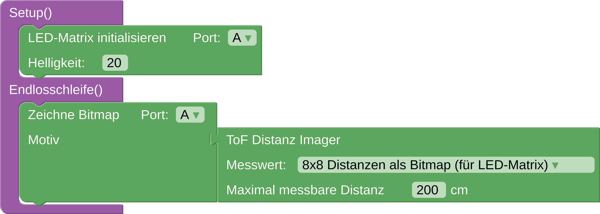

In diesem Projekt kannst du dir die Distanzmessungen des ToF-Sensors auf einer LED-Matrix anzeigen lassen. ... Erklärung von ToF ... maximal 4 Meter ... Drinnen weiter als draussen messbar

## Aufbauen
Schließe den Distanzsensor per Qwiic Kabel an eine I2C Schnittstelle der senseBox an. Schließe nun die LED-Matrix an der GPIO Schnittstelle "A" an.



## Programmieren

Die Programmierung der Messstation wird in [Blockly](https://blockly.sensebox.de) durchgeführt. Wähle dafür die senseBox MCU-S2 als Board aus. 

Initialisiere als erstes die LED-Matrix im __Setup()__ und füge den Block __Zeichne Bitmap__ in die Endlosschleife ein. Wähle nun in der Gruppe der Sensorblöcke den __ToF Imager__ aus. Füge diesen beim "Motiv" Steckplatz des __Zeichne Bitmap__ Block ein und wähle im Dropdown Menu der Distanz "als Bitmap" aus. ... einstellen der maximal messbaren Distanz (Die Distanzwerte werden ja auf dem Regenbogenfarbspektrum angezeigt. Wenn man maximal messbare Distanz auf 4000 mm einstellt, dann unterscheiden sich kleine distanzunterschiede kaum in der Farbe. Deshalb kann man das einstellen, falls man eh nur an nahen Distanzen interessiert ist) ... 



## Ausprobieren

Wenn du dieses Skript auf die senseBox lädst werden dir nun die 8x8 Distanzen, die der ToF Sensor aufnimmt, als verschieden gefärbte Pixel angezeigt. ... winken, dran vorbei laufen, ...

(vlt kann hier ein Foto vom Aufbau in echt, wo man irwas auf der Matrix sieht)
